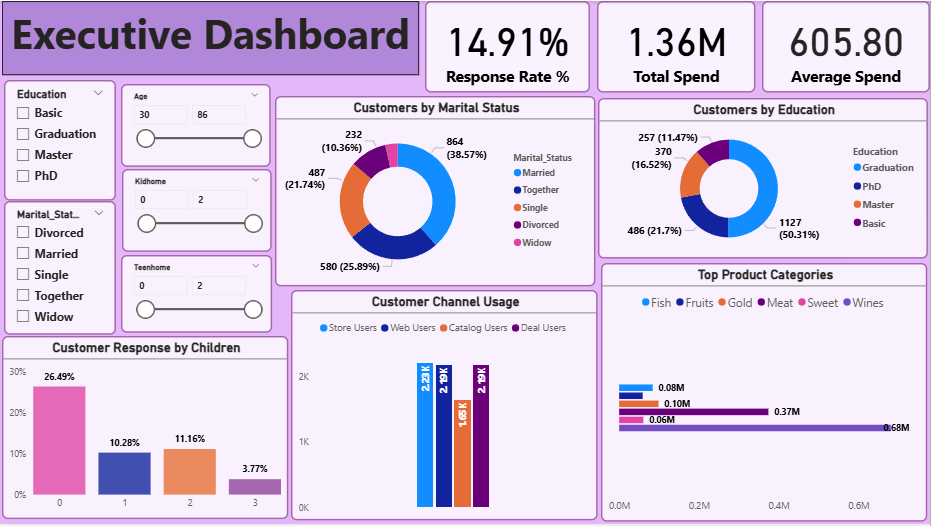
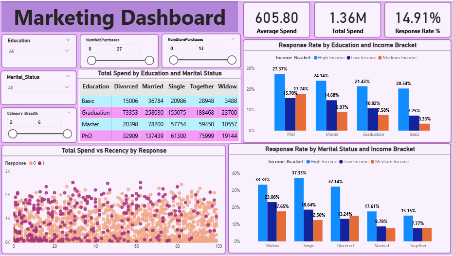

# 📈 Superstore Marketing Campaign Analysis

## 🎯 Overview

A customer analytics and marketing campaign project aimed at understanding customer behavior, identifying high-value segments, and predicting Gold Membership acceptance using statistical analysis and machine learning.

---

## 📂 Dataset

**2,240 customer records** containing:

* 👤 Customer demographics
* 💰 Income & spending behavior
* 🛒 Product category purchases
* 🌐 Purchase channels
* 📢 Campaign responses
* ⏳ Customer recency

---

## ❓ Business Problem

The company promotes a **Gold Membership Program** offering a 20% discount on purchases. However, only **14.91%** of customers accepted the offer, resulting in low campaign effectiveness and inefficient marketing targeting.

The objective was to identify likely buyers and improve future campaign performance through data-driven decision making.

---

## 🛠️ Tech Stack

* 📊 **Excel** – Data quality assessment & validation
* 🗄️ **SQL** – Data extraction, validation & views
* 🐍 **Python** – Cleaning, EDA, statistics & machine learning
* 📈 **Power BI** – Interactive dashboards & visualization

---

## 🔄 Project Workflow

### 🧹 Data Cleaning

* Handled missing values and income outliers
* Standardized categories and date formats
* Corrected invalid IDs and unrealistic age values

### ⚙️ Feature Engineering

Created business-focused features such as:

* Age
* Tenure
* Total Spend
* Total Children
* Category Breadth
* Total Purchases
* Web vs Store Purchase ratio

### 🔍 Exploratory Data Analysis

* Customer segmentation analysis
* Spending behavior analysis
* Channel performance analysis
* Customer segments by Education, Marital Status, and Children

### 📊 Statistical Analysis

Performed:

* T-Test
* ANOVA
* Chi-Square Test

to validate customer spending and response behavior across different customer groups.

### 🤖 Predictive Modeling

**Business Challenge:**
Low campaign acceptance rate (14.91%) created a class imbalance problem, making buyer prediction difficult.

Models evaluated:

| Model                        | Accuracy | Recall |
| ---------------------------- | -------- | ------ |
| Logistic Regression          | 85.71%   | 6.25%  |
| Balanced Logistic Regression | 70.31%   | 65.62% |
| Random Forest                | 85.94%   | 28.12% |

> **📝 Note:** In marketing campaigns, Recall is more important than Accuracy because missing potential buyers is costlier than contacting a few extra customers.

✅ Balanced Logistic Regression delivered the strongest business outcome by increasing buyer identification from **4 to 42 customers** while improving Recall from **6.25% to 65.62%**.

---

## 💡 Key Insights

* 💰 High-income customers showed the highest spending and response rates.
* 👨‍👩‍👧 Customers without children spent significantly more and responded better to campaigns.
* 🍷 Wine and Meat categories generated the largest share of revenue.
* 🏪 Store purchases remained the most preferred customer channel.
* 🎯 Income, Total Spend, and Recency were the strongest response drivers.

---

## 📊 Dashboard Highlights

### Executive Dashboard

* Tracks KPIs such as Response Rate, Total Spend, and Average Spend.
* Analyzes customer demographics, education, marital status, and channel usage.
* Highlights top-performing product categories and customer segments.

### Marketing Dashboard

* Evaluates response rates across income, education, and marital groups.
* Identifies high-performing customer segments for campaign targeting.
* Visualizes spending behavior, recency, and response relationships.

---

## 🚀 Recommendations

* Target high-income customers through personalized campaigns.
* Re-engage inactive customers using reminder campaigns and limited-time offers.
* Strengthen digital channels through incentives and promotions.
* Use predictive-model-based targeting for future campaigns.

---

## 📈 Business Impact

* Increased buyer identification from **4 to 42 customers**.
* Improved campaign targeting through a **10× increase in Recall**.
* Enabled data-driven customer segmentation and marketing decisions.

---

## 📷 Dashboard Preview

### Executive Dashboard

### Marketing Dashboard

---

### 👩‍💻 Author

**Vanshika Srivastava**
Aspiring Data Analyst | Excel | SQL | Python | Power BI
